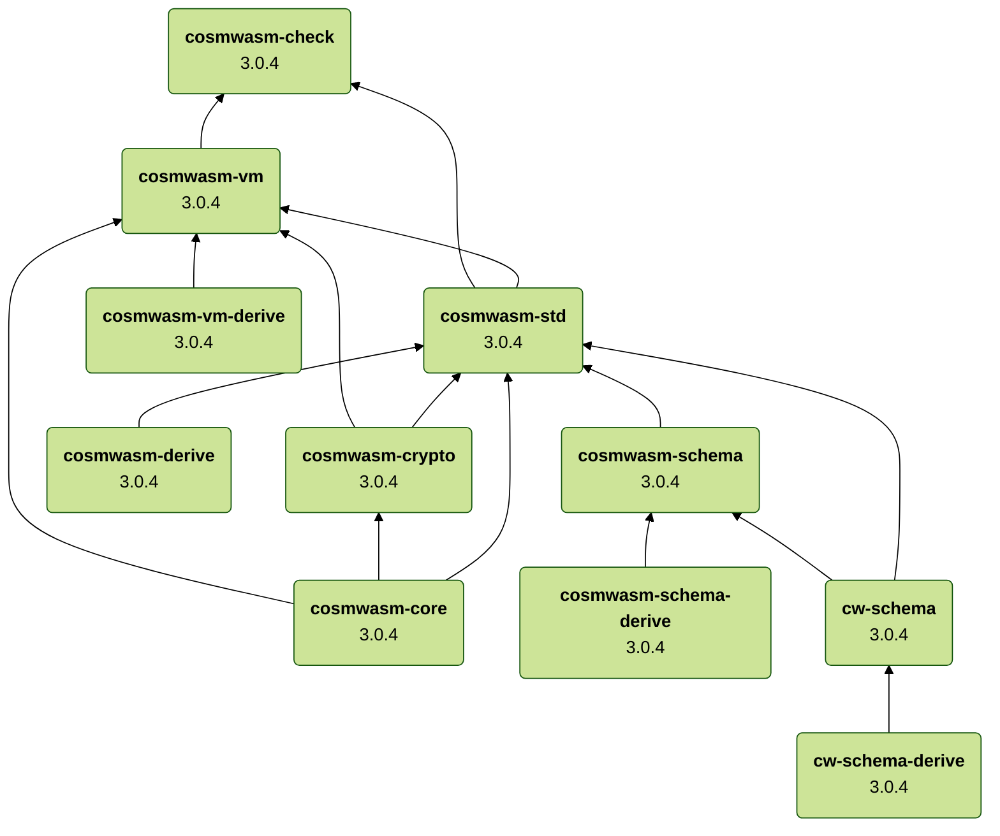
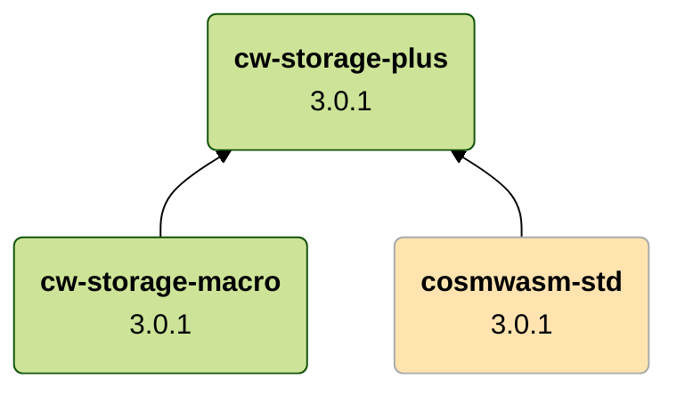

# Components

[wasmd]: https://github.com/CosmWasm/wasmd
[wasmvm]: https://github.com/CosmWasm/wasmvm
[cosmwasm]: https://github.com/CosmWasm/cosmwasm
[cw-storage-plus]: https://github.com/CosmWasm/cw-storage-plus
[cw-minus]: https://github.com/CosmWasm/cw-minus
[cw-plus]: https://github.com/CosmWasm/cw-plus
[cw-multi-test]: https://github.com/CosmWasm/cw-multi-test
[serde-json-wasm]: https://github.com/CosmWasm/serde-json-wasm

## Maintained repositories

| Repository        | Description |
|-------------------|-------------|
| [wasmd]           | (tbd)       |
| [wasmvm]          | (tbd)       |
| [cosmwasm]        | (tbd)       |
| [cw-storage-plus] | (tbd)       |
| [cw-minus]        | (tbd)       |
| [cw-plus]         | (tbd)       |
| [cw-multi-test]   | (tbd)       |
| [serde-json-wasm] | (tbd)       |

## Maintained crates

| Name                               | Version                                                                                 | Repository        |
|------------------------------------|-----------------------------------------------------------------------------------------|-------------------|
| cosmwasm&#8209;check               | [![cosmwasm-check][cosmwasm-check-badge]][cosmwasm-check-crate]                         | [cosmwasm]        |
| cosmwasm&#8209;std                 | [![cosmwasm-std][cosmwasm-std-badge]][cosmwasm-std-crate]                               | [cosmwasm]        |
| cosmwasm&#8209;derive              | [![cosmwasm-derive][cosmwasm-derive-badge]][cosmwasm-derive-crate]                      | [cosmwasm]        |
| cosmwasm&#8209;crypto              | [![cosmwasm-crypto][cosmwasm-crypto-badge]][cosmwasm-crypto-crate]                      | [cosmwasm]        |
| cosmwasm&#8209;core                | [![cosmwasm-core][cosmwasm-core-badge]][cosmwasm-core-crate]                            | [cosmwasm]        |
| cosmwasm&#8209;schema              | [![cosmwasm-schema][cosmwasm-schema-badge]][cosmwasm-schema-crate]                      | [cosmwasm]        |
| cosmwasm&#8209;schema&#8209;derive | [![cosmwasm-schema-derive][cosmwasm-schema-derive-badge]][cosmwasm-schema-derive-crate] | [cosmwasm]        |
| cosmwasm&#8209;vm                  | [![cosmwasm-vm][cosmwasm-vm-badge]][cosmwasm-vm-crate]                                  | [cosmwasm]        |
| cosmwasm&#8209;vm&#8209;derive     | [![cosmwasm-vm-derive][cosmwasm-vm-derive-badge]][cosmwasm-vm-derive-crate]             | [cosmwasm]        |
| cw&#8209;schema                    | [![cw-schema][cw-schema-badge]][cw-schema-crate]                                        | [cosmwasm]        |
| cw&#8209;schema&#8209;derive       | [![cw-schema-derive][cw-schema-derive-badge]][cw-schema-derive-crate]                   | [cosmwasm]        |
| cw&#8209;storage&#8209;plus        | [![cw-storage-plus][cw-storage-plus-badge]][cw-storage-plus-crate]                      | [cw-storage-plus] |
| cw&#8209;storage&#8209;macro       | [![cw-storage-macro][cw-storage-macro-badge]][cw-storage-macro-crate]                   | [cw-storage-plus] |
| cw&#8209;multi&#8209;test          | [![cw-multi-test][cw-multi-test-badge]][cw-multi-test-crate]                            | [cw-multi-test]   |
| serde&#8209;json&#8209;wasm        | [![storey-storage][serde-json-wasm-badge]][serde-json-wasm-crate]                       | [serde-json-wasm] |

[cosmwasm-check-badge]: https://img.shields.io/crates/v/cosmwasm-check.svg
[cosmwasm-check-crate]: https://crates.io/crates/cosmwasm-check

[cosmwasm-std-badge]: https://img.shields.io/crates/v/cosmwasm-std.svg
[cosmwasm-std-crate]: https://crates.io/crates/cosmwasm-std

[cosmwasm-derive-badge]: https://img.shields.io/crates/v/cosmwasm-derive.svg
[cosmwasm-derive-crate]: https://crates.io/crates/cosmwasm-derive

[cosmwasm-crypto-badge]: https://img.shields.io/crates/v/cosmwasm-crypto.svg
[cosmwasm-crypto-crate]: https://crates.io/crates/cosmwasm-crypto

[cosmwasm-core-badge]: https://img.shields.io/crates/v/cosmwasm-core.svg
[cosmwasm-core-crate]: https://crates.io/crates/cosmwasm-core

[cosmwasm-schema-badge]: https://img.shields.io/crates/v/cosmwasm-schema.svg
[cosmwasm-schema-crate]: https://crates.io/crates/cosmwasm-schema

[cosmwasm-schema-derive-badge]: https://img.shields.io/crates/v/cosmwasm-schema-derive.svg
[cosmwasm-schema-derive-crate]: https://crates.io/crates/cosmwasm-schema-derive

[cosmwasm-vm-badge]: https://img.shields.io/crates/v/cosmwasm-vm.svg
[cosmwasm-vm-crate]: https://crates.io/crates/cosmwasm-vm

[cosmwasm-vm-derive-badge]: https://img.shields.io/crates/v/cosmwasm-vm-derive.svg
[cosmwasm-vm-derive-crate]: https://crates.io/crates/cosmwasm-vm-derive

[cw-multi-test-badge]: https://img.shields.io/crates/v/cw-multi-test.svg
[cw-multi-test-crate]: https://crates.io/crates/cw-multi-test

[cw-schema-badge]: https://img.shields.io/crates/v/cw-schema.svg
[cw-schema-crate]: https://crates.io/crates/cw-schema

[cw-schema-derive-badge]: https://img.shields.io/crates/v/cw-schema-derive.svg
[cw-schema-derive-crate]: https://crates.io/crates/cw-schema-derive

[cw-storage-plus-badge]: https://img.shields.io/crates/v/cw-storage-plus.svg
[cw-storage-plus-crate]: https://crates.io/crates/cw-storage-plus

[cw-storage-macro-badge]: https://img.shields.io/crates/v/cw-storage-macro.svg
[cw-storage-macro-crate]: https://crates.io/crates/cw-storage-macro

[serde-json-wasm-badge]: https://img.shields.io/crates/v/serde-json-wasm.svg
[serde-json-wasm-crate]: https://crates.io/crates/serde-json-wasm

## Dependencies

### `wasmd` repository

### `wasmvm` repository

### `cosmwasm` repository

The following diagram illustrates the dependencies between CosmWasm components maintained
in the [cosmwasm] repository.

### `cw-storage-plus` repository

The following diagram depicts the dependencies between components maintained
in the [cw-storage-plus] repository.

:::note

The highlighted blocks represent dependencies on CosmWasm components maintained
in [cosmwasm] repository.

:::

### `cw-minus` repository

### `cw-plus` repository

### `cw-multi-test` repository

### `serde-json-wasm` repository
