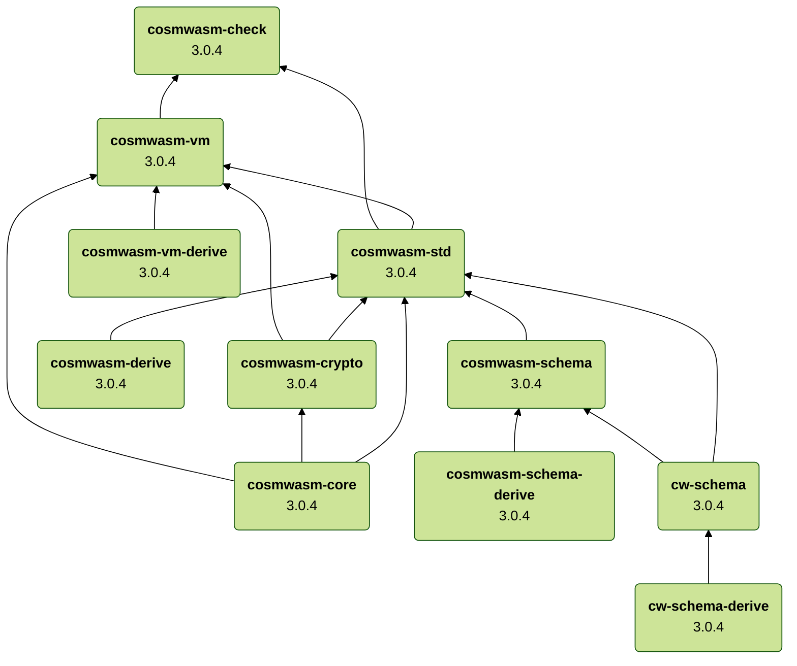
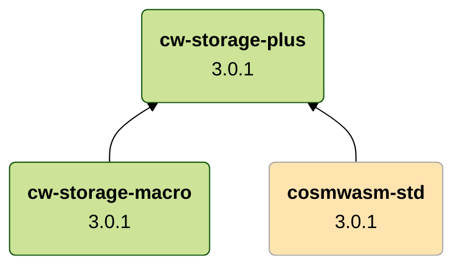

# Components

[cosmwasm]: https://github.com/CosmWasm/cosmwasm
[cw-storage-plus]: https://github.com/CosmWasm/cw-storage-plus

## Dependencies

### `cosmwasm` repository

The following diagram depicts the dependencies between CosmWasm components maintained
in the [cosmwasm] repository. 

### `cw-storage-plus` repository

The following diagram depicts the dependencies between components maintained
in the [cw-storage-plus] repository.

:::note

The highlighted blocks depict dependencies to CosmWasm components maintained
in [cosmwasm] repository.

:::
