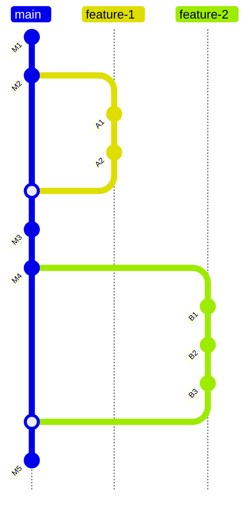
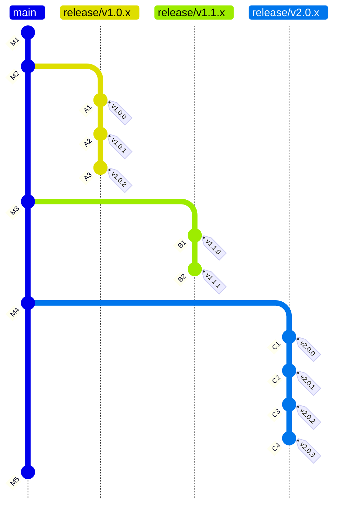
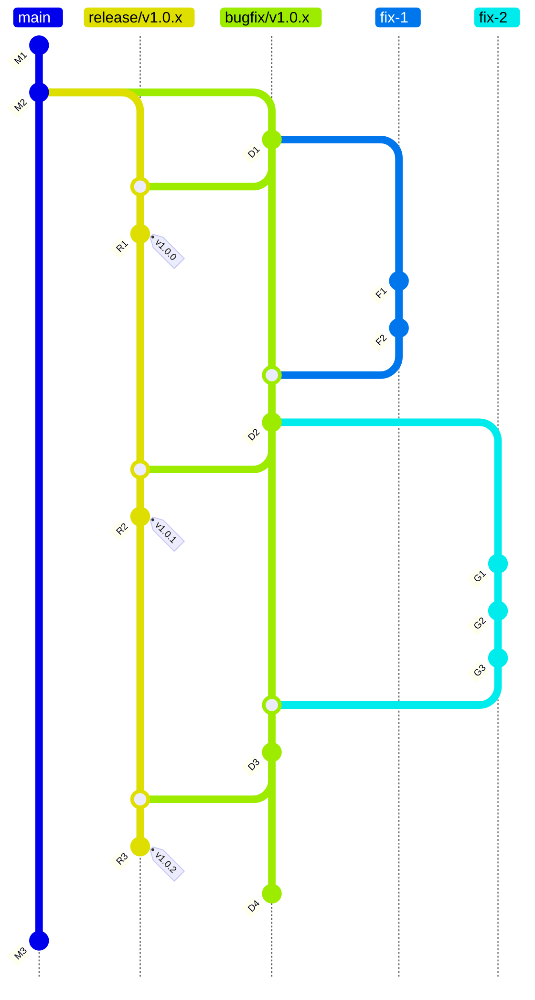

# Development process

## New features

aaa

```mermaid
gitGraph TB:
       commit id:"M1"
       commit id:"M2"
       branch feature-1
       commit id:"A1"
       commit id:"A2"
       checkout main
       merge feature-1
       commit id:"M3"
       commit id:"M4"
       branch feature-2
       commit id:"B1"
       commit id:"B2"
       commit id:"B3"
       checkout main
       merge feature-2
       commit id:"M5"
```

## Releases

bbb

```mermaid
gitGraph TB:
       commit id:"M1"
       commit id:"M2"
       branch release/v1.0.x
       commit id:"A1" tag:"v1.0.0"
       commit id:"A2" tag:"v1.0.1"
       commit id:"A3" tag:"v1.0.2"
       checkout main
       commit id:"M3"
       branch release/v1.1.x
       commit id:"B1" tag:"v1.1.0"
       commit id:"B2" tag:"v1.1.1"
       checkout main
       commit id:"M4"
       branch release/v2.0.x
       commit id:"C1" tag:"v2.0.0"
       commit id:"C2" tag:"v2.0.1"
       commit id:"C3" tag:"v2.0.2"
       commit id:"C4" tag:"v2.0.3"
       checkout main
       commit id:"M5"
```

## Bug fixes

ccc

```mermaid
gitGraph TB:
       commit id:"M1"
       commit id:"M2"
       branch bugfix/v1.0.x order: 2
       branch release/v1.0.x order: 1
       checkout bugfix/v1.0.x
       commit id:"D1"
       checkout release/v1.0.x
       merge bugfix/v1.0.x
       commit id:"R1" tag:"v1.0.0"
       checkout bugfix/v1.0.x
       branch fix-1 order: 3
       commit id:"F1"
       commit id:"F2"
       checkout bugfix/v1.0.x
       merge fix-1
       commit id:"D2"
       checkout release/v1.0.x
       merge bugfix/v1.0.x
       commit id:"R2" tag:"v1.0.1"
       checkout bugfix/v1.0.x
       branch fix-2 order: 4
       commit id:"G1"
       commit id:"G2"
       commit id:"G3"
       checkout bugfix/v1.0.x
       merge fix-2
       commit id:"D3"
       checkout release/v1.0.x
       merge bugfix/v1.0.x
       commit id:"R3" tag:"v1.0.2"
       checkout bugfix/v1.0.x
       commit id:"D4"
       checkout main
       commit id:"M3"
```
