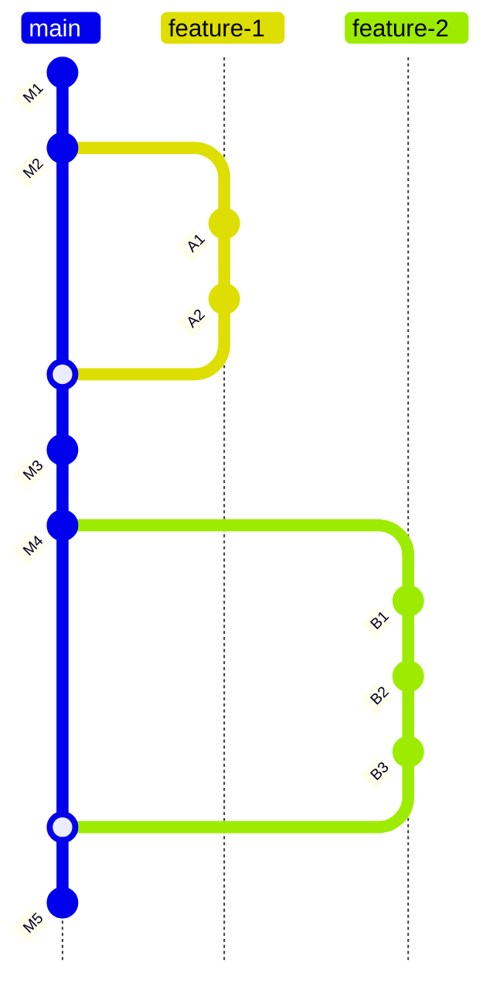
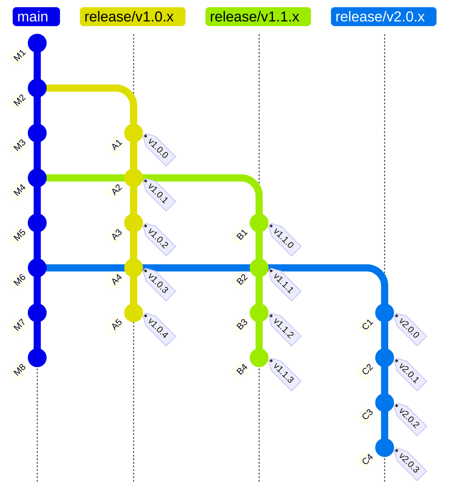
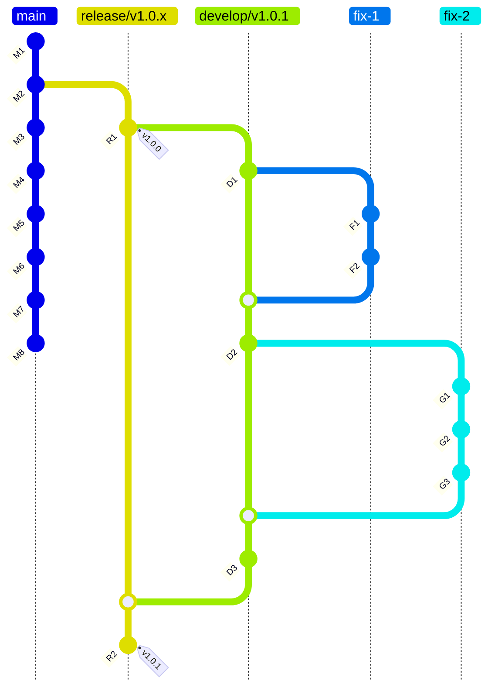

# Development process

## New features

aaa



## Releases

bbb



## Bug fixes

ccc



### Example

```shell
git checkout release/v2.2.x
```

```shell
git checkout -b develop/v2.2.6
```

> magg develop

```shell
git checkout -b fix-1
```

- Implement **fix-1**
- Merge PR with **fix-1** to `develop/v2.2.6`

```shell
git checkout develop/v2.2.6
```

```shell
git checkout -b fix-2
```

- Implement **fix-2**
- Merge PR with **fix-2** to `develop/v2.2.6`

```shell
git checkout develop/v2.2.6
```

```shell
git checkout -b fix-3
```

- Implement **fix-3**
- Merge PR with **fix-3** to `develop/v2.2.6`

```shell
git checkout develop/v2.2.6
```

> magg publish

- Merge `develop/v2.2.6` to `release/v2.2.x`

```shell
git tag -s v2.2.6 -m "Published version v2.2.6"
```
