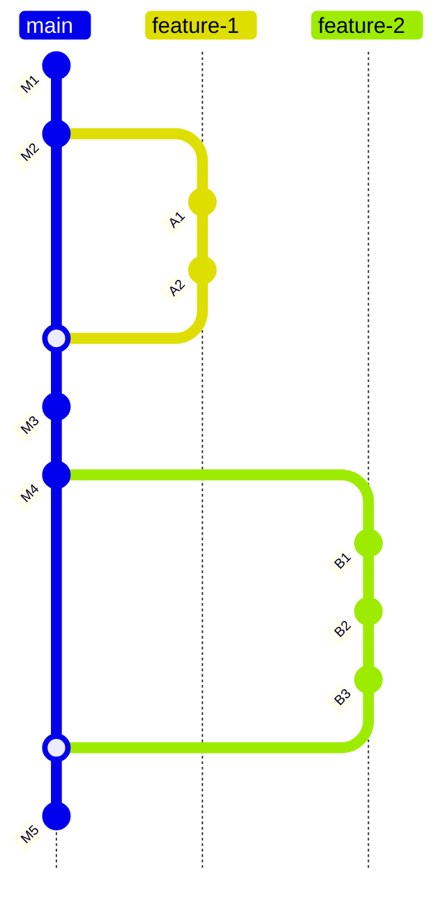
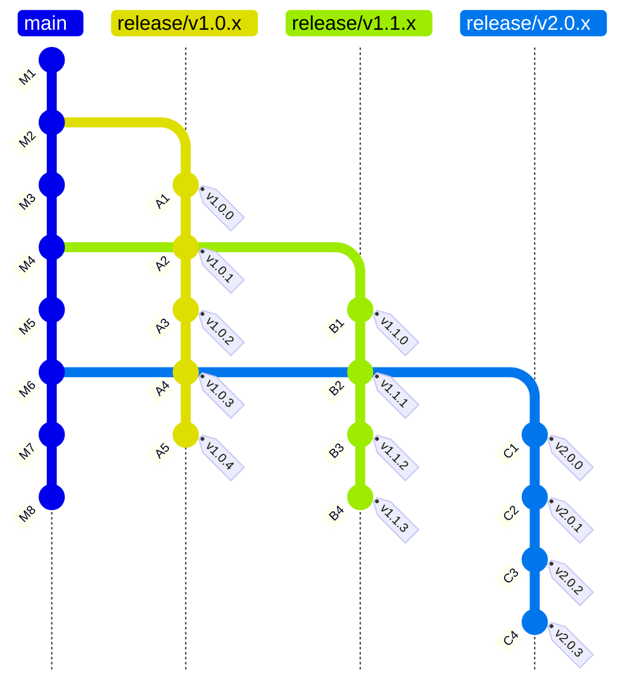
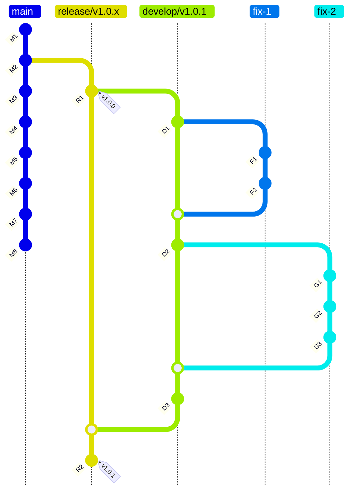

# Development process

## New features

**NEW FEATURES ARE DEVELOPED ON `main` BRANCH**

All meaningful changes are introduced to the codebase through branches aligned with GitHub pull requests
and MUST be always reviewed before reaching the `main` branch.
Developers **SHOULD NOT** commit new features directly to `main` branch. Instead, each change is implemented
in a dedicated branch created from `main`, for example: `feature-1` or `feature-2` (see the diagram below).
All development work, such as commits **A1**, **A2** or **B1**, **B2**, **B3**, happens on these branches.
Each feature branch is associated with a GitHub pull request targeting `main` branch. The PR is the place where
code review, discussion, automated checks, and CI validation occur. While a PR is open, the `main` branch remains
unchanged, ensuring it always reflects a stable, review-approved state. Only once the PR is approved and ready
is the feature branch merged into `main` branch. After a PR is merged, additional commits may be made directly
on `main` (**M3**, **M4**, **M5**), but only by maintainers.
These commits typically represent post-merge activities such as small fixes after the merge, minor refactorings,
integration adjustments or small documentation updates. Any non-trivial follow-up work should again be done
in a new feature branch and merged via a separate PR. In practice, developers **SHOULD** treat main as a protected
branch: it advances only through merged pull requests and intentional stabilization commits.
All feature development, experimentation, and iteration happens on branches, with PRs acting as the gatekeeper
that ensures quality and consistency before changes become part of `main` branch.



## Releases

**VERSIONS ARE RELEASED AND MAINTAINED BASED ON `release/**` BRANCHES**

The following diagram illustrates a **release branch** based versioning strategy, where the `main` branch
represents the ongoing development. Each released **major** or **minor** version line is maintained independently
through dedicated release branches. The `main` branch advances through commits like **M1** and **M2**,
which represent a normal development work that is not yet part of any released version.
When the project is ready to ship version **1.0**, a release branch `release/v1.0.x` is created from `main` branch.
This branch becomes the long-lived home for the **v1.0** release line. The first commit (**A1**) on this branch
is tagged `v1.0.0`, marking the initial public release. Subsequent commits (like **A2**, **A3**), apply bug fixes only
and are tagged as patch releases: `v1.0.1`, `v1.0.2`, and so on. **NO NEW FEATURES** are introduced on the release branch,
its sole purpose is just to stabilize and maintain the released version. While the `v1.0.x` line is being maintained,
development continues independently on main (**M3**). When the next minor version is ready to be published,
a new release branch `release/v1.1.x` is created from the current state of `main` branch.
The first commit on this branch is tagged `v1.1.0`, representing the initial **1.1** release.
As with the previous release branch, any defects discovered after release are fixed directly on `release/v1.1.x`
and published as patch versions `v1.1.1`. Meanwhile, the `main` branch continues to evolve (**M5**) without being
constrained by the stabilization requirements of released versions. The same pattern is repeated for major
version **2.0**. A new release branch `release/v2.0.x` is cut from main once the **2.0** feature set is complete.
The initial release is tagged `v2.0.0` at commit **C1**, and multiple follow-up commits **C2**..**C4** deliver
bug fixes as successive patch releases `v2.0.1` through `v2.0.3`. This allows the **2.0** line to remain stable
and supported even as main moves forward with new development (**M7**, **M8**, and so on).

Overall, this workflow makes versioning explicit and predictable. New features are developed only on main,
released versions are maintained on dedicated release branches, and bug fixes are applied directly to the relevant release branch and published
as patch releases. This approach enables parallel maintenance of multiple supported versions while keeping ongoing
development on main enabled.



## Bug fixes

**BUGS ARE FIXED USING `develop/**` BRANCHES DERIVED FROM `release/**` BRANCHES**

Bug fixes are implemented on branches aligned with GitHub pull requests targeting the temporary
`develop/**` branches derived from `release/**` branches for which the fixes apply.
The following diagram depicts a process of applying two fixes to released version `v1.0.0`.
Version `v1.0.0` is released from branch `release/v1.0.x` and tagged as `v1.0.0`.
From this point, the new branch `develop/v1.0.1` must be created before implementing the fixes.
Each fix is implemented separately on dedicated branch, like `fix-1` and `fix-2`, associated
with PRs that MUST be revied and approved. Bugs are fixed in commits **F1**, **F2** and
**G1** though **G3**. After merging bug fixes to the common temporary branch `develop/v1.0.1`,
this `develop/v1.0.1` branch SHOULD be reviewed again and approved in separate PR.
Approved `develop/v1.0.1` branch MUST be merged to `release/v1.0.x` branch. After merge,
the new version `v1.0.1` is published and tagged as `v1.0.1`.



**Example commands**

```shell
git checkout release/v1.0.x
```

```shell
git checkout -b develop/v1.0.1
```

> magg develop

```shell
git checkout -b fix-1
```

- Implement **fix-1**
- Merge PR with **fix-1** to `develop/v1.0.1`

```shell
git checkout develop/v1.0.1
```

```shell
git checkout -b fix-2
```

- Implement **fix-2**
- Merge PR with **fix-2** to `develop/v1.0.1`

```shell
git checkout develop/v1.0.1
```

> magg publish

- Merge `develop/v1.0.1` to `release/v1.0.x`

```shell
git tag -s v1.0.1 -m "Published version v1.0.1"
```
